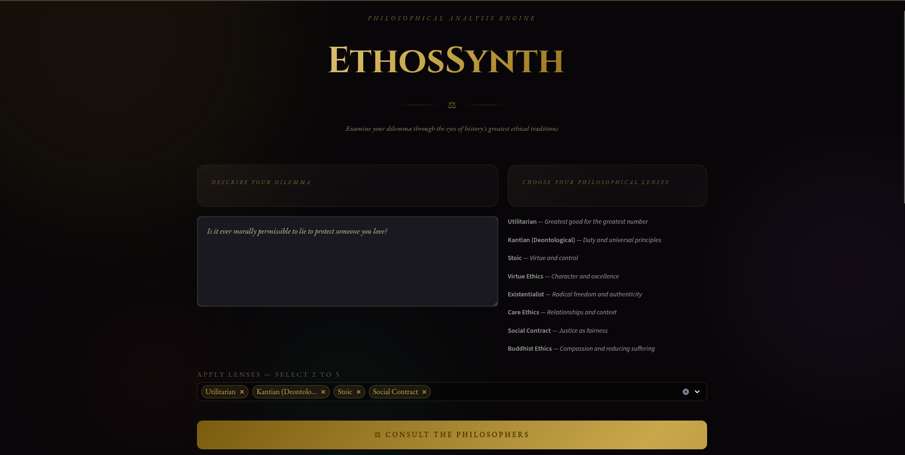
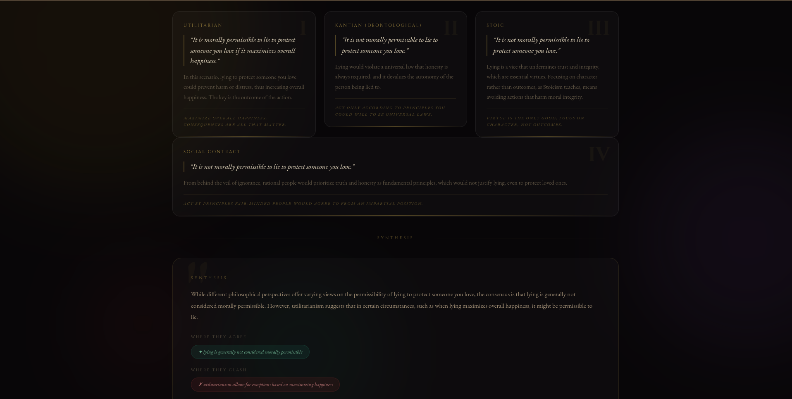

<div align="center">


# EthosSynth — Moral Dilemma Analyzer

### *Understand any ethical dilemma through the lens of eight philosophical traditions*

[](https://python.org)
[](https://fastapi.tiangolo.com)
[](https://streamlit.io)
[](https://huggingface.co)
[](LICENSE)

<br/>

> EthosSynth takes any moral dilemma and runs it through **eight distinct philosophical frameworks** simultaneously — delivering structured, AI-powered ethical reasoning and a comparative synthesis in seconds.

<br/>

</div>

---

##  What It Does

Paste in any ethical dilemma — real or hypothetical — and EthosSynth will:

1. **Analyze** it through 8 philosophical lenses in parallel
2. **Structure** each argument with premises, reasoning, and conclusions
3. **Synthesize** the perspectives into a comparative overview
4. **Visualize** everything through a clean, interactive UI

Whether you're a student exploring moral philosophy, a researcher studying AI ethics, or someone wrestling with a real-world decision, EthosSynth gives you a rigorous multi-perspective breakdown — instantly.

---
## 🖥️ UI Preview

### Home Page


### Analysis View


##  Supported Philosophical Frameworks

| Philosophy | Core Principle |
|---|---|
| ⚡ **Utilitarianism** | Greatest good for the greatest number |
|  **Kantian Ethics** | Duty, universalizability, and the categorical imperative |
|  **Stoicism** | Virtue, reason, and what lies within your control |
|  **Virtue Ethics** | Character-based morality and human flourishing |
|  **Existentialism** | Radical freedom, authenticity, and personal responsibility |
|  **Care Ethics** | Relationships, context, and the ethics of caring |
|  **Social Contract** | Fairness, mutual agreement, and collective principles |
|  **Buddhist Ethics** | Compassion, non-harm, and reduction of suffering |

---

##  Live Demo

>  Deployed on **HuggingFace Spaces** + **Render**

```
Frontend (Streamlit):  https://huggingface.co/spaces/<your-username>/ethos-synth
Backend  (FastAPI):    https://ethos-synth-api.onrender.com
API Docs (Swagger):    https://ethos-synth-api.onrender.com/docs
```

---

##  Architecture

```
┌─────────────────────────────────────────────────────┐
│                   User Interface                    │
│              Streamlit Frontend (UI)                │
└───────────────────────┬─────────────────────────────┘
                        │ HTTP POST /analyze
                        ▼
┌─────────────────────────────────────────────────────┐
│                FastAPI Backend                      │
│           Request validation (Pydantic)             │
└───────────────────────┬─────────────────────────────┘
                        │
                        ▼
┌─────────────────────────────────────────────────────┐
│            AI Reasoning Pipeline                    │
│    analyzer.py — asyncio parallel execution         │
│                                                     │
│   ┌──────┐ ┌──────┐ ┌──────┐ ┌──────┐ ┌──────┐      │
│   │Util. │ │Kant. │ │Stoic │ │Virt. │ │Exist.│      │
│   └──┬───┘ └──┬───┘ └──┬───┘ └──┬───┘ └──┬───┘      │
│      └────────┴────────┴────────┴─────────┘         │
│                        │ asyncio.gather()           │
│                        ▼                            │
│              Comparative Synthesis                  │
└───────────────────────┬─────────────────────────────┘
                        │
                        ▼
┌─────────────────────────────────────────────────────┐
│        HuggingFace Inference API                    │
│        Qwen2.5 / Mistral LLM                        │
└─────────────────────────────────────────────────────┘
                        │
                        ▼
              Structured JSON Response
                        │
                        ▼
              Frontend renders UI cards
```

---

##  Project Structure

```
moral-dilemma-analyzer/
│
├── app/
│   ├── main.py            # FastAPI backend — routes, request/response models
│   └── analyzer.py        # AI reasoning pipeline — async parallel LLM calls
│
├── frontend/
│   └── streamlit_app.py   # Streamlit UI — interactive interface & result rendering
│
├── .env.example           # Environment variable template
├── requirements.txt       # Python dependencies
└── README.md
```

---

##  Tech Stack

| Layer | Technology | Purpose |
|---|---|---|
| **Frontend** | Streamlit | Interactive UI |
| **Backend** | FastAPI | REST API server |
| **AI Model** | Qwen2.5 / Mistral | LLM reasoning via HuggingFace |
| **Async** | asyncio | Parallel philosophy calls |
| **Validation** | Pydantic | Request/response schema |
| **HTTP Client** | httpx / requests | API communication |
| **Deployment** | HuggingFace Spaces + Render | Frontend + Backend hosting |

---

##  Getting Started

### Prerequisites

- Python 3.10+
- A [HuggingFace account](https://huggingface.co) with an API token

### 1. Clone the repository

```bash
git clone https://github.com/<your-username>/moral-dilemma-analyzer.git
cd moral-dilemma-analyzer
```

### 2. Create and activate a virtual environment

```bash
python -m venv venv
source venv/bin/activate        # Linux / macOS
venv\Scripts\activate           # Windows
```

### 3. Install dependencies

```bash
pip install -r requirements.txt
```

### 4. Configure environment variables

```bash
cp .env.example .env
```

Open `.env` and fill in your values:

```env
HUGGINGFACE_API_TOKEN=hf_xxxxxxxxxxxxxxxxxxxxxxxxxxxx
MODEL_ID=Qwen/Qwen2.5-72B-Instruct   # or mistralai/Mistral-7B-Instruct-v0.3
BACKEND_URL=http://localhost:8000
```

### 5. Start the backend

```bash
uvicorn app.main:app --reload --port 8000
```

The FastAPI server runs at `http://localhost:8000`. Interactive API docs at `http://localhost:8000/docs`.

### 6. Start the frontend

```bash
streamlit run frontend/streamlit_app.py
```

The Streamlit app opens at `http://localhost:8501`.

---

##  API Reference

### `POST /analyze`

Analyze a moral dilemma across all philosophical frameworks.

**Request Body**

```json
{
  "dilemma": "A self-driving car must choose between hitting one pedestrian or swerving and killing its passenger. What should it do?",
  "frameworks": ["utilitarian", "kantian", "stoic", "virtue", "existentialist", "care", "social_contract", "buddhist"]
}
```

**Response**

```json
{
  "dilemma": "...",
  "analyses": {
    "utilitarian": {
      "framework": "Utilitarianism",
      "core_principle": "Greatest good for the greatest number",
      "reasoning": "...",
      "conclusion": "..."
    },
    "kantian": { "..." },
    "..."
  },
  "synthesis": "Across all frameworks, a tension emerges between...",
  "processing_time_ms": 1842
}
```

**Status Codes**

| Code | Meaning |
|------|---------|
| `200` | Analysis successful |
| `422` | Validation error — check request body |
| `500` | LLM inference error |

---


<div align="center">

Built with curiosity about ethics, philosophy, and the limits of AI reasoning.

**⭐ Star this repo if you find it useful!**

</div>
